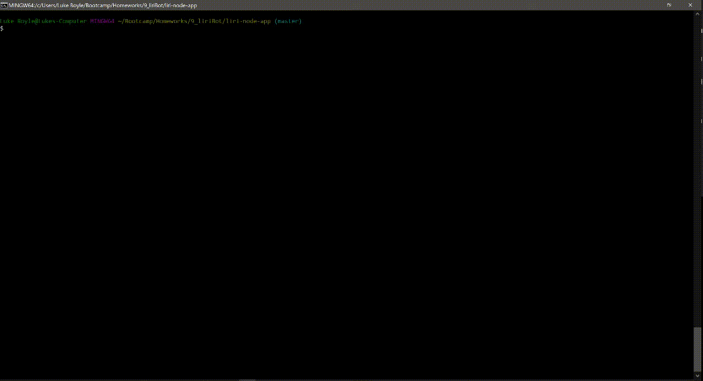

# LIRI-Bot
Look up your favorite artist/band, song or movie and get back data for each.

## Instructions
Use in a terminal.

To look up a band enter `concert-this` followed by the name of an artist or band.
To look up a song enter `spotify-this-song` followed by the name of a song.
To look up a movie enter `movie-this` followed by the name of a movie.
Enter `do-what-it-says` for a surprise!

All the data is also saved in log.txt.

## What It Teaches
How to use node.js for retrieving and showing data

## Languages/Technologies 
* JavaScript
* Node.js

## Demo

## Future Development/Improvements
- [ ] Add more things to let user look up
- [ ] Incorporate inquirer (or something similar)

## Links
[Portfolio](https://lmboyle.github.io/)
